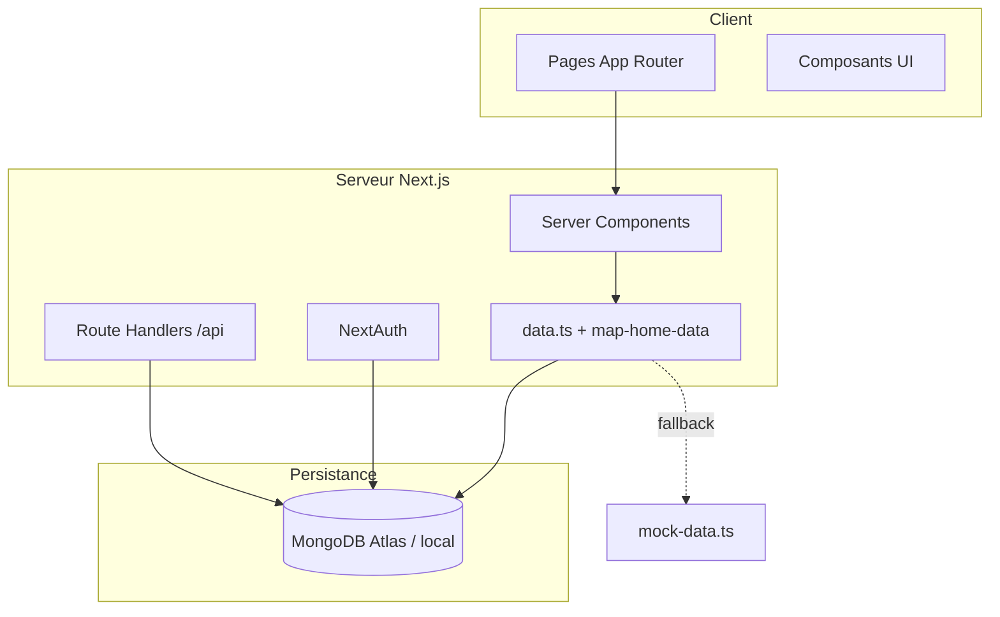

# Global South Watch

**Portail magazine & presse en ligne** dédié à l'information sur l'Afrique et le Sud global.  
Journalisme indépendant, interface éditoriale moderne, back-office intégré et expérience lecteur complète (abonnement, paywall, multimédia).

---

## Sommaire

- [Aperçu](#aperçu)
- [Fonctionnalités](#fonctionnalités)
- [Stack technique](#stack-technique)
- [Architecture](#architecture)
- [Prérequis](#prérequis)
- [Installation](#installation)
- [Configuration](#configuration)
- [Initialisation des données](#initialisation-des-données)
- [Scripts disponibles](#scripts-disponibles)
- [Structure du projet](#structure-du-projet)
- [Authentification & rôles](#authentification--rôles)
- [API REST](#api-rest)
- [Design system](#design-system)
- [Déploiement](#déploiement)
- [Dépannage](#dépannage)

---

## Aperçu

Global South Watch est une application **full-stack** construite avec **Next.js 16** (App Router). Elle combine :

- une **homepage magazine** riche (urgent, hero, rubriques, tribunes, vidéos, stats) ;
- des **pages article** avec paywall, commentaires et partage social ;
- un **espace admin** pour la rédaction ;
- une couche **API** pour la recherche, la newsletter, le flux RSS et les interactions lecteur.

Sans base MongoDB configurée, l'application bascule automatiquement sur des **données de démonstration** intégrées au code — utile pour explorer l'UI immédiatement.

---

## Fonctionnalités

### Côté lecteur

| Module | Description |
|--------|-------------|
| **Accueil** | Masthead, fil urgent, carrousel hero, choix de la rédaction, dernières actus, tribunes, thématiques, vidéos, stats & newsletter |
| **Articles** | Contenu riche (HTML), galerie, vidéo, podcast, progression de lecture, articles liés |
| **Rubriques** | Pages catégorie avec article vedette et grille |
| **Recherche** | Recherche full-text sur les articles publiés |
| **Urgent** | Page dédiée aux alertes et breaking news |
| **Multimédia** | Hubs `/videos` et `/podcasts` |
| **Compte** | Inscription, connexion (email ou Google), profil, historique, articles sauvegardés |
| **Abonnement** | Plans premium et paywall sur les contenus exclusifs |
| **Institutionnel** | À propos, équipe, charte, contact, mentions légales, accessibilité… |

### Côté rédaction (`/admin`)

- Tableau de bord (articles, utilisateurs, commentaires, newsletter)
- Gestion des articles (création, édition, statuts : brouillon → publié)
- Modération des commentaires
- Gestion des catégories et auteurs
- Paramètres et métadonnées

### SEO & distribution

- `sitemap.xml` et `robots.txt` générés
- Flux RSS via `/api/feed`
- Métadonnées Open Graph par article

---

## Stack technique

| Couche | Technologies |
|--------|--------------|
| **Framework** | [Next.js 16](https://nextjs.org/) (App Router, RSC, ISR) |
| **UI** | React 19, CSS custom (design system « Revolution »), Tailwind CSS 4 |
| **Base de données** | [MongoDB](https://www.mongodb.com/) + [Mongoose](https://mongoosejs.com/) |
| **Auth** | [NextAuth.js v5](https://authjs.dev/) (Credentials + Google OAuth) |
| **Formulaires** | React Hook Form + Zod |
| **Éditeur** | TipTap (back-office) |
| **Utilitaires** | date-fns, slugify, bcryptjs, lucide-react |

---

## Architecture



**Flux de données homepage :**

1. `getHomePageData()` interroge MongoDB (ou mock).
2. `mapHomePageData()` transforme les documents en sections UI typées.
3. Les composants `presse-ivoire/*` rendent chaque bande éditoriale.

---

## Prérequis

- **Node.js** ≥ 20
- **npm** ≥ 10
- **MongoDB** : instance locale ou cluster [MongoDB Atlas](https://www.mongodb.com/atlas)
- *(Optionnel)* Compte Google Cloud pour OAuth (`GOOGLE_CLIENT_ID` / `GOOGLE_CLIENT_SECRET`)

---

## Installation

```bash
# 1. Cloner le dépôt
git clone <url-du-repo> magasine
cd magasine

# 2. Installer les dépendances
npm install

# 3. Configurer l'environnement
cp .env.example .env.local
# Éditer .env.local avec vos valeurs

# 4. Lancer le serveur de développement
npm run dev
```

Ouvrir [http://localhost:3000](http://localhost:3000).

---

## Configuration

Créer un fichier `.env.local` à la racine (voir `.env.example`) :

| Variable | Obligatoire | Description |
|----------|-------------|-------------|
| `MONGODB_URI` | Recommandé | URI de connexion MongoDB. Sans elle, mode démo activé |
| `NEXTAUTH_URL` | Oui | URL publique de l'app (ex. `http://localhost:3000`) |
| `NEXTAUTH_SECRET` | Oui | Secret JWT — générer avec `openssl rand -base64 32` |
| `GOOGLE_CLIENT_ID` | Non | OAuth Google |
| `GOOGLE_CLIENT_SECRET` | Non | OAuth Google |

> **Sécurité :** ne commitez jamais `.env.local`. En production, utilisez des secrets forts et distincts.

### Images distantes

Les domaines autorisés pour `next/image` sont configurés dans `next.config.ts` :

- `images.unsplash.com` (visuels éditoriaux)
- `api.dicebear.com` (avatars auteurs)

Pour ajouter un CDN ou bucket S3, étendre `images.remotePatterns`.

---

## Initialisation des données

Une fois MongoDB configuré et le serveur lancé :

```bash
# Première initialisation (catégories, auteurs, 24 articles, alertes, admin)
curl http://localhost:3000/api/seed

# Réinitialisation complète (efface les données existantes)
curl "http://localhost:3000/api/seed?force=true"
```

Ou via le script npm (serveur déjà démarré) :

```bash
npm run seed
```

**Compte administrateur créé par le seed :**

| Champ | Valeur |
|-------|--------|
| Email | `admin@globalsouthwatch.com` |
| Mot de passe | `Admin123!` |

> Changez ce mot de passe immédiatement en production.

---

## Scripts disponibles

| Commande | Action |
|----------|--------|
| `npm run dev` | Serveur de développement avec hot-reload |
| `npm run build` | Build de production |
| `npm run start` | Serveur de production (après `build`) |
| `npm run lint` | Analyse ESLint |
| `npm run seed` | Appelle `/api/seed` (nécessite `dev` ou `start` actif) |

---

## Structure du projet

```
magasine/
├── public/
│   └── images/              # Logo, partenaires presse
├── src/
│   ├── app/                 # Routes App Router
│   │   ├── api/             # Route Handlers REST
│   │   ├── admin/           # Back-office rédaction
│   │   ├── article/         # Pages article
│   │   ├── category/        # Category pages
│   │   ├── author/          # Author pages
│   │   ├── globals.css      # Design system & tokens
│   │   ├── responsive.css   # Breakpoints mobile
│   │   └── revolution.css   # Thème « Revolution Edition »
│   ├── components/
│   │   ├── presse-ivoire/   # UI homepage & chrome site
│   │   ├── article/         # Détail article, paywall, commentaires
│   │   ├── admin/           # Composants back-office
│   │   └── ui/              # Primitives partagées
│   ├── data/                # Données statiques (nav, partenaires)
│   ├── lib/
│   │   ├── data.ts          # Couche d'accès données (DB + fallback)
│   │   ├── auth.ts          # Configuration NextAuth
│   │   ├── seed-data.ts     # Jeu de données de démo
│   │   └── mongodb.ts       # Connexion Mongoose (cache global)
│   ├── models/              # Schémas Mongoose
│   └── types/               # Types TypeScript partagés
├── .env.example
├── next.config.ts
└── package.json
```

---

## Authentification & rôles

L'accès à `/admin` est protégé par **middleware** (`src/middleware.ts`).

| Rôle | Accès admin | Droits typiques |
|------|-------------|-----------------|
| `super_admin` | Oui | Tout |
| `admin` | Oui | Gestion éditoriale complète |
| `editor` | Oui | Articles, commentaires |
| `author` | Oui | Ses propres contenus |
| `contributor` | Non | Soumission (selon évolution) |
| `reader` | Non | Lecture, commentaires, abonnement |

**Connexion :** `/login` — email/mot de passe ou Google (si configuré).

**Paywall :** les articles `isPremium` sont accessibles aux abonnés premium, auteurs et rôles admin.

---

## API REST

| Endpoint | Méthode | Description |
|----------|---------|-------------|
| `/api/seed` | GET | Initialise la base (`?force=true` pour réinitialiser) |
| `/api/search` | GET | Recherche d'articles (`?q=`) |
| `/api/feed` | GET | Flux RSS |
| `/api/newsletter` | POST | Inscription newsletter |
| `/api/register` | POST | Création de compte lecteur |
| `/api/comments` | GET, POST | Commentaires par article |
| `/api/contact` | POST | Formulaire de contact |
| `/api/subscription` | POST | Gestion abonnement |
| `/api/user/profile` | GET | Profil utilisateur connecté |
| `/api/user/saved` | POST | Sauvegarder un article |
| `/api/user/history` | POST | Historique de lecture |
| `/api/admin/articles` | POST | Créer un article |
| `/api/admin/articles/[id]` | GET, PATCH, DELETE | CRUD article |
| `/api/admin/comments` | GET, PATCH | Modération |
| `/api/admin/meta` | GET | Statistiques admin |
| `/api/auth/[...nextauth]` | * | Handlers NextAuth |

---

## Design system

Identité visuelle alignée sur le logo :

| Token | Valeur | Usage |
|-------|--------|-------|
| `--brand-blue` | `#1a3896` | Primaire, tags, CTA |
| `--brand-brown` | `#94563c` | Accent, badges live |
| `--cream` / `--white` | Fonds clairs | Thème clair uniquement |

Polices : **Syne** (titres), **DM Sans** (UI), **Newsreader** (corps éditorial).

Le thème **Revolution Edition** (`revolution.css`) ajoute glassmorphism, animations de révélation au scroll et layout bento sur la homepage.

---

## Déploiement

### Build de production

```bash
npm run build
npm run start
```

### Variables d'environnement production

- `NEXTAUTH_URL` → URL HTTPS du domaine final
- `NEXTAUTH_SECRET` → secret unique et long
- `MONGODB_URI` → cluster production (IP allowlist / VPC)

### Plateformes recommandées

- [Vercel](https://vercel.com/) — déploiement Next.js natif
- [Render](https://render.com/) — web service Node.js
- MongoDB Atlas — base managée

### Checklist avant mise en ligne

- [ ] Changer le mot de passe admin seed
- [ ] Configurer `metadataBase` dans `layout.tsx` (URL canonique OG)
- [ ] Vérifier les domaines `remotePatterns` pour vos images
- [ ] Activer HTTPS et cookies sécurisés NextAuth
- [ ] Limiter l'accès à `/api/seed` (désactiver ou protéger en prod)

---

## Dépannage

### Les images ne s'affichent pas

- Vérifier que l'URL de l'image est dans `remotePatterns` (`next.config.ts`)
- Les URLs Unsplash invalides sont corrigées à la volée via `resolveFeaturedImage()` dans `src/lib/images.ts`
- Le logo local doit être présent : `public/images/logo-global-south-watch.png`

### Erreur MongoDB / seed

- Vérifier `MONGODB_URI` sans espace parasite dans le nom de base
- Atlas gratuit : limite de 500 collections — supprimer les bases de test inutilisées
- Sans MongoDB : l'app fonctionne en mode mock automatiquement

### Accès admin refusé

- Se connecter avec un compte ayant un rôle `admin`, `editor` ou `super_admin`
- Lancer `/api/seed` si aucun utilisateur admin n'existe

### `npm run seed` échoue sous Windows

Utiliser PowerShell :

```powershell
Invoke-WebRequest http://localhost:3000/api/seed
```

---

## Licence

Projet privé — tous droits réservés.  
Contact éditorial : [contact@globalsouthwatch.com](mailto:contact@globalsouthwatch.com)

---

**Global South Watch** — L'information au cœur du Sud global
